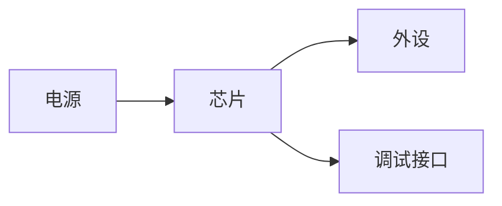

# [芯片型号] 笔记分享 🛠️

> 简介：一句话描述这个芯片是干嘛的，以及你为什么会用到它，例如低功耗、性价比、特定外设或高速接口。

## 1. 核心特性快速参考 ⚡

| 特性 | 参数值 | 备注 |
| :--- | :--- | :--- |
| **内核** | [例如：Cortex-M0+] | |
| **主频** | [例如：64 MHz] | |
| **供电电压** | [例如：1.8V - 3.6V] | 注意稳压范围 |
| **封装** | [例如：QFN32] | |
| **Flash / RAM** | [例如：64KB / 16KB] | |
| **关键接口** | [例如：I2C、SPI、UART] | |

::: tip 适用场景
这一段适合先给结论，再告诉读者这颗芯片适合做什么、不适合做什么。
:::

::: warning 先看限制
如果芯片在电压、时钟、温度或封装上有硬约束，建议在这一节先写出来，避免后面误用。
:::

## 2. 硬件连线与最小系统 📟

::: tip 硬件要点
在这里分享 PCB 布线时的注意事项，例如去耦电容位置、复位脚处理、上拉/下拉、电平域和特殊引脚要求。
:::

- **必备引脚连接**：
  - `PA1 -> SWDIO`：调试接口
  - `PA2 -> SWCLK`：调试接口
  - `VCC -> 电源`：供电输入
  - `GND -> 地`：公共参考地

### 图表示例

#### 源码示例



#### 渲染效果示例


### 图片示例

这里适合放板框图、时序图、原理图截图或手绘草图。

#### 源码示例

```markdown

```

#### 渲染效果示例

> 图片渲染效果会显示在正文中，建议替换成你自己的图床地址或本地图片路径。

### 额外说明

如果你只是想在正文里提醒“这里有图”，也可以先写成占位文字，后面再补真实图片。

## 3. 术语与公式 ✏️

这一节适合放电压、电流、频率、截止点、分压、时序等公式。

### 源码示例

```markdown
行内公式：$V_{out}$、$I_{max}$、$f_c$

块级公式：

$$
f_c = \frac{1}{2\pi RC}
$$

$$
V_{out} = V_{in} \cdot \frac{R_2}{R_1 + R_2}
$$
```

### 渲染效果示例

行内公式：$V_{out}$、$I_{max}$、$f_c$

块级公式：

$$
f_c = \frac{1}{2\pi RC}
$$

$$
V_{out} = V_{in} \cdot \frac{R_2}{R_1 + R_2}
$$

::: tip 公式显示建议
简单变量可以放行内，复杂分式、上下标很多、带积分或求和的表达式，优先使用块级公式。
:::

## 4. 表格与对照 📋

这一节适合放参数对照、模式速率、寄存器位定义、地址格式等。

### 源码示例

```markdown
| 项目 | 值 | 说明 |
| :--- | :--- | :--- |
| 模式 | 标准模式 | 适合低速总线 |
| 模式 | 快速模式 | 适合更高吞吐 |
| 模式 | 高速模式 | 需要更严格布局 |
```

### 渲染效果示例

| 项目 | 值 | 说明 |
| :--- | :--- | :--- |
| 模式 | 标准模式 | 适合低速总线 |
| 模式 | 快速模式 | 适合更高吞吐 |
| 模式 | 高速模式 | 需要更严格布局 |

::: tip 表格建议
表格尽量先给结论列，再给补充说明列。超过四列时，优先拆成两个表。
:::

## 5. 代码块 💻

推荐分享经过实测的、最精简的初始化代码或驱动函数。

### 源码示例

```c
// [功能描述]
void init_example(void) {
    // 初始化时钟或外设
}
```

### 渲染效果示例

```c
// [功能描述]
void init_example(void) {
    // 初始化时钟或外设
}
```

## 6. 折叠说明与补充信息 📎

::: details 展开查看补充说明
这里可以放更长的背景解释、边界条件、版本差异、公式推导或不适合打断正文的小节。
:::

## 7. 避坑指南/踩坑记录 🚧

⚠️ **这是本笔记最有价值的部分。**

- **现象**：描述你遇到的 Bug 或异常现象。
- **根由**：分析为什么会发生，是手册没看仔细还是官方库的 Bug。
- **对策**：你是怎么解决的，代码怎么改。

::: danger 常见错误
如果这里写的是会导致烧板、死机、通信失效或数据错误的问题，建议把现象和对策写得更直接。
:::

## 8. 相关参考链接 🔗

- [官方数据手册下载](http://...)
- [参考固件库地址](http://...)
- [封装和引脚图](http://...)

---

> [你的名字 / ID] 分享于 [日期]
