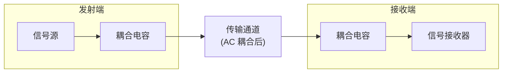
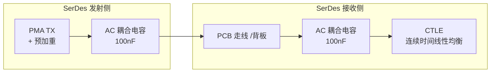

# AC 耦合技术文档

## 1. 什么是 AC 耦合

在电子信号传输中，一个电压信号可以分解为**直流分量（DC）**和**交流分量（AC）**两部分。直流分量是信号的静态偏置电平，交流分量是其中随时间变化的部分。

AC 耦合的核心功能是：**允许交流分量通过，同时阻断直流分量**。

这一特性在高速串行链路中尤为关键——发射端与接收端可能工作在不同共模电压下，若不进行隔离，直流偏置差异会直接导致接收端偏置点偏离最佳眼图中心，引发信号失真。

上图所示，耦合电容位于发射端与传输线之间，以及传输线与接收端之间，承担了直流隔离的任务。

---

## 2. 物理本质：电容隔直原理

电容的阻抗 $Z_C$ 由其容值和信号频率决定：

$$
Z_C = \frac{1}{j\omega C} = \frac{1}{j2\pi f C}
$$

从公式可以看出：

| 频率 | 阻抗 | 效果 |
|------|------|------|
| $f \to 0$（直流） | $\|Z_C\| \to \infty$ | 近似开路，阻断直流 |
| $f$ 升高 | $\|Z_C\|$ 减小 | 交流信号逐渐可以通过 |
| $f \to \infty$ | $\|Z_C\| \to 0$ | 近似短路 |

因此，电容在电路中表现为一个**频率依赖的"可变阻抗"**——对低频信号呈现高阻抗（阻断），对高频信号呈现低阻抗（通过）。

**一个直观的类比**：电容如同一条对水流中的漩涡（交流）开放、但对平静水面（直流）关闭的闸门。

---

## 3. 在高速链路中的应用

### 3.1 SerDes 链路

在高速串行收发器（Serializer/Deserializer）中，AC 耦合几乎是标配。以 10G SerDes 为例：

常见耦合电容位置：发射端与 PCB 走线之间、连接器两侧、接收端输入前端。

### 3.2 PCIe、SATA、USB、以太网

| 协议 | 典型耦合电容位置 | 常见容值 |
|------|-----------------|----------|
| PCIe Gen3/4/5 | TX/RX 每条 lane 串联 | 100nF |
| SATA | TX/RX 串联 | 10nF–100nF |
| USB 3.x | TX/RX 串联 | 100nF |
| 10BASE-T | TX/RX 串联 | 100nF |
| 100BASE-TX | TX/RX 串联 | 10nF |

以 PCIe 为例，规范（PCIe Base Spec）要求耦合电容位于发送端和接收端之间，每条差分 lane 必须串联一个电容，用于阻断发射端与接收端的共模直流偏置差异。

---

## 4. 设计参数如何选取

### 4.1 耦合电容的阻抗计算

对于一个 10Gbps 的 NRZ 信号，其第一零点频率约为 10GHz（即数据速率本身）。若选取 100nF 电容：

$$
Z_C = \frac{1}{2\pi \times 10 \times 10^9 \times 100 \times 10^{-9}} \approx 0.16\ \Omega
$$

$0.16\Omega$ 的阻抗相对于传输线 $50\Omega$ 特性阻抗可以忽略不计，不会对信号造成显著衰减。

### 4.2 低频截止频率

耦合电容与接收端输入阻抗形成的高通滤波器截止频率为：

$$
f_{3dB} = \frac{1}{2\pi R C}
$$

其中 $R$ 为接收端的差分输入阻抗（高速 SerDes 接收端通常为 $100\Omega$ 差分或芯片手册中的 DC 输入阻抗值）。

**设计时需确保**：最低有用信号频率对应的阻抗应远小于 $R$：
$$
f_{min} \gg \frac{1}{2\pi R C}
$$

### 4.3 容值选取原则

| 需求场景 | 推荐容值 | 说明 |
|----------|----------|------|
| 10G+ SerDes | 100nF | 低阻抗，宽带宽 |
| PCIe Gen3/4 | 100nF | 规范要求 |
| 1G 以太网 | 10nF–100nF | 视链路长度而定 |
| 音频耦合 | 1µF–10µF | 低频信号需要更大容值 |

**过大容值的问题**：占用 PCB 面积大，成本增加，大封装电容的寄生电感（ESL）更大。

**过小容值的问题**：低频阻抗增大，导致低频信号衰减，码间干扰（ISI）加重。

### 4.4 可靠性考虑

- **耐压**：选取耐压为工作电压 2–3 倍的电容（常用 16V、25V）
- **温度特性**：NP0/C0G（陶瓷）电容温度稳定性最好，适用于高速链路
- **封装**：0402/0201 是高速电路主流，寄生电感更小

---

## 5. 常见误区与设计陷阱

### 5.1 欠耦合：电容容值过小

| 症状 | 原因 |
|------|------|
| 低频内容丢失 | $f_{3dB}$ 过高，低于信号最低频率分量 |
| 眼图塌陷 | 长连 0/1 序列的低频部分被衰减 |

### 5.2 过耦合：电容容值盲目求大

| 症状 | 原因 |
|------|------|
| 占用 PCB 面积大 | 高容值需要更大封装 |
| 上电冲击电流增大 | 电容越大，瞬态充电电流越大 |

### 5.3 混淆 AC 耦合与 DC 偏置

AC 耦合**阻断直流**，但**不提供直流偏置**。如果接收端需要特定共模电压，必须在接收端单独设计 DC 偏置电路（如电阻分压到 VDD/2）。

### 5.4 耦合电容位置不当

| 错误 | 后果 |
|------|------|
| 将耦合电容放在驱动端输出与端接电阻之间 | 端接电阻与电容形成低通滤波器，恶化高频 |
| 在发送端预加重/去加重后立即放置耦合电容 | 预加重的高频分量被进一步放大，可能超出传输线线性范围 |

### 5.5 忽视电容的阻抗相位特性

实际电容在高频下表现为 **ESR + ESL + C** 的串联模型，而非理想电容。当频率超过电容自谐振频率（SRF）后，电容不再表现为容性，而表现为感性：

$$
Z_{real} \approx ESR + j(\omega L - \frac{1}{\omega C})
$$

因此，在毫米波频段（60GHz+）选用电容时，SRF 是比容值更关键的参数。

---

## 小结

AC 耦合是高速数字链路中一项基础却至关重要的设计技术。其本质是利用电容的频率阻抗特性——阻断直流分量通过，同时对高速交流信号呈现极低的阻抗。在实际设计中，需要综合考虑信号最低频率、阻抗匹配、封装尺寸和可靠性，选择合适的容值和放置位置。

理解这一技术背后的物理原理，而非机械地套用经验值，是避免设计陷阱的根本。
