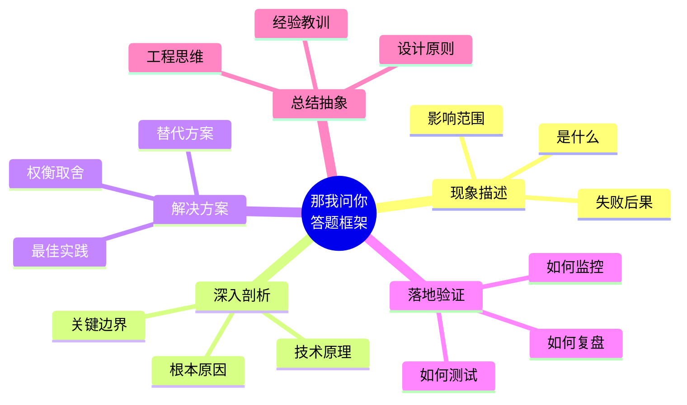

# 那我问你

这个专题的核心，不是“背标准答案”，而是训练你在面试高压场景下，能把问题讲成一条完整的工程推理链。

你会反复遇到这样的追问：

- 这个现象背后的根因是什么？
- 为什么你的方案比备选方案更合适？
- 如果边界条件变化，结论是否仍然成立？

笔者希望你最终具备的能力是：不只会答“是什么”，更能答“为什么”和“怎么做”。

同样的，如果在阅读时发现了任何问题，或者有更好的改进建议，随时欢迎提 Issue 或 PR 来共同完善！

## 本章定位

这是一个面试题库与答题框架的大集合，覆盖从基础概念到工程落地的关键方向：

- Linux 驱动开发：内核机制、设备模型、中断与并发。
- Linux 应用开发：系统编程、多进程多线程、IPC 与性能。
- FPGA 开发：时序约束、资源权衡、工程化实现。
- C/C++ 编程：语言本质、内存模型、并发与性能优化。
- 通信协议开发：协议栈、状态机、异常处理与调优。
- 硬件设计：SI/PI、时序与可靠性、可制造性思维。

## 内容导航

### 📚 LINUX 开发

::: tip 🟢 [Linux驱动开发](./linux/linux-driver.md)
内核模块、设备树、中断处理
:::

::: info 🔵 [Linux应用开发](./linux/linux-app.md)
系统编程、多进程/线程、IPC
:::

### 📚 FPGA 开发

::: tip 🟢 [FPGA开发](./fpga/fpga.md)
HDL设计、时序约束、综合优化
:::

### 📚 其它

::: tip 🟢 [C/C++编程](./others/cpp.md)
语言特性、内存管理、性能优化
:::

::: info 🔵 [通信协议](./others/protocols.md)
I2C、SPI、USB、以太网
:::

::: warning 🟠 [硬件设计](./others/hardware.md)
PCB设计、信号完整性、电源管理
:::

## 面试解题框架

## 使用建议

- 不要只记结论，要能复述推导过程。
- 每道题至少准备一个“真实项目片段”作为佐证。
- 每次练习都补一条“如果重做一次，我会怎么优化”。
- 回答尽量形成闭环：问题定义、原因分析、方案选择、结果验证。

::: info 📚 扩展阅读
- [AC耦合技术详解](../should-know/si-pi/ac-coupling.md)
- [I2C通信协议](../protocols/hardware/i2c.md)
- [差分信号：以 LVDS 为经典例子](../should-know/si-pi/differential-signaling-lvds.md)
:::