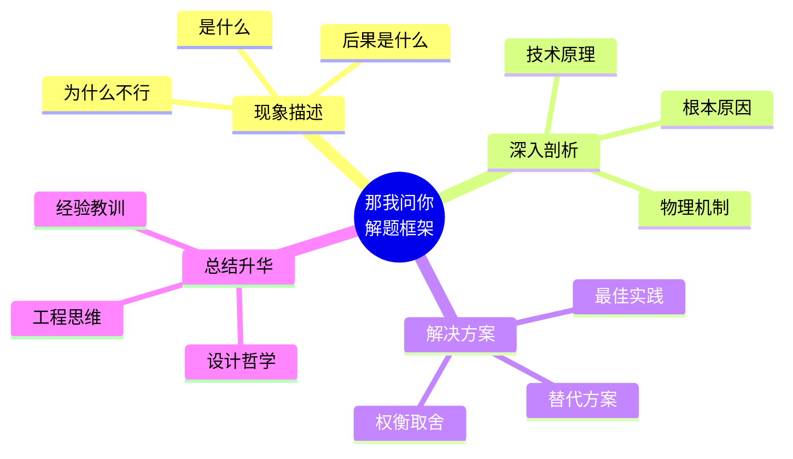

# 那我问你

::: tip 💡 什么是"那我问你"？
这里的"那我问你"不是传统意义上的死记硬背，而是对核心概念的深度剖析。通过面试官的视角提出问题，引导你从现象到本质的思考过程。每个问题都配有详细解答，帮助你在面试和实际工作中建立扎实的技术基础。
:::

## 技术方向导航

::: info 📚 各方向专题
- [Linux驱动开发](./linux-driver.md) - 内核模块、设备树、中断处理
- [Linux应用开发](./linux-app.md) - 系统编程、多进程/线程、IPC
- [FPGA开发](./fpga.md) - HDL设计、时序约束、综合优化
- [C/C++编程](./cpp.md) - 语言特性、内存管理、性能优化
- [通信协议](./protocols.md) - I2C、SPI、USB、以太网
- [硬件设计](./hardware.md) - PCB设计、信号完整性、电源管理
:::

## 思维导图：面试解题框架

::: info 📚 扩展阅读
- [AC耦合技术详解](./ac-coupling.md)
- [I2C通信协议](../protocols/i2c.md)
- [PCB设计最佳实践](../under-construction)
:::