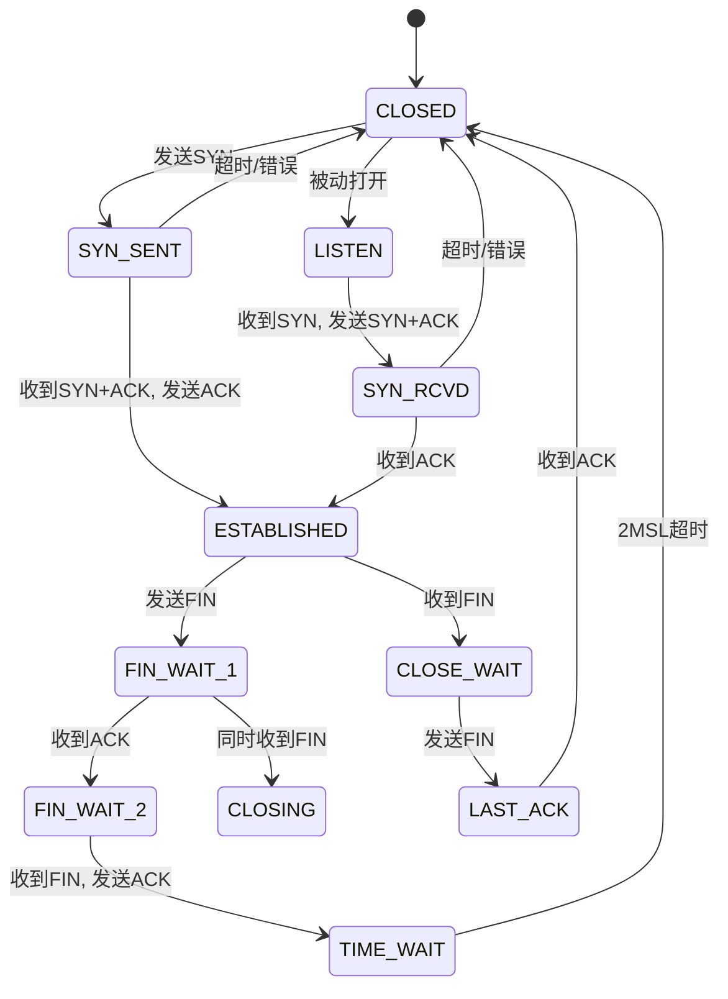

# 通信协议开发面试题

::: tip 💡 核心要点
通信协议开发重点考察协议栈实现、状态机设计、错误处理、以及性能优化。面试官通常会从基础协议格式入手，逐步深入到复杂的并发处理和协议优化。
:::

## 协议基础

### 1. OSI vs TCP/IP模型

::: warning ❓ OSI七层模型和TCP/IP四层模型有什么区别？为什么TCP/IP更实用？
面试官翻了翻简历："你做过通信协议开发，那我问你，OSI和TCP/IP模型的区别是什么？"

::: details 💡 点击查看满分回答
**OSI是理论模型，TCP/IP是实际实现的标准。**

**OSI七层模型：**
- **第7层 应用层**：HTTP、FTP、SMTP
- **第6层 表示层**：数据格式转换、加密
- **第5层 会话层**：会话建立、管理、终止
- **第4层 传输层**：端到端连接（TCP/UDP）
- **第3层 网络层**：路由选择（IP）
- **第2层 数据链路层**：MAC地址、帧格式
- **第1层 物理层**：比特流传输

**TCP/IP四层模型：**
- **应用层**：HTTP、FTP、DNS（合并了OSI的应用、表示、会话层）
- **传输层**：TCP、UDP
- **网际层**：IP、ICMP
- **网络接口层**：以太网、WiFi（对应OSI的数据链路和物理层）

**为什么TCP/IP更实用：**
- **简化设计**：合并了功能相似的层
- **实际部署**：基于TCP/IP的互联网成功
- **灵活性**：允许底层技术多样性
- **性能优化**：减少协议栈开销

**协议栈对比：**
- **OSI**：理论完善，但实现复杂
- **TCP/IP**：实用优先，广泛应用
- **混合使用**：现代协议栈往往结合两者优点
:::

### 2. TCP vs UDP

::: warning ❓ TCP和UDP有什么区别？什么时候用TCP，什么时候用UDP？
面试官点了点头："TCP和UDP的区别你能说说吗？视频通话为什么用UDP？"

::: details 💡 点击查看满分回答
**TCP可靠有序，UDP快速无连接。**

**TCP（Transmission Control Protocol）：**
- **连接方式**：面向连接，三次握手建立连接
- **可靠性**：保证数据到达，无损、按序、不重复
- **流量控制**：滑动窗口，防止发送方过快
- **拥塞控制**：动态调整发送速率，避免网络拥塞
- **适用场景**：文件传输、Web浏览、邮件

**UDP（User Datagram Protocol）：**
- **连接方式**：无连接，直接发送数据包
- **可靠性**：不保证到达，可能丢失、乱序
- **性能**：低延迟，低开销
- **适用场景**：实时应用、DNS查询、视频流

**详细对比：**

| 特性 | TCP | UDP |
|------|-----|-----|
| **连接** | 需要 | 无需 |
| **可靠性** | 保证 | 不保证 |
| **有序性** | 保证 | 不保证 |
| **速度** | 较慢 | 快 |
| **开销** | 大 | 小 |
| **应用** | HTTP、FTP | DNS、VOIP |

**为什么视频通话用UDP：**
- **实时性优先**：UDP低延迟，TCP重传可能造成卡顿
- **容忍丢包**：视频编解码能处理少量丢包
- **广播支持**：UDP支持广播，TCP只能点对点
- **自定义可靠性**：应用层实现选择性重传

**选择原则：**
- **数据完整性重要用TCP**：如文件传输
- **实时性重要用UDP**：如游戏、视频
- **小数据包用UDP**：如DNS查询
- **大数据用TCP**：如HTTP下载
:::

## 协议实现

### 3. 状态机设计

::: warning ❓ 通信协议的状态机怎么设计？TCP握手状态机是怎样的？
面试官敲了敲桌子："协议状态机设计有什么原则？TCP三次握手的状态转换图画一下？"

::: details 💡 点击查看满分回答
**协议状态机确保通信过程的有序性和正确性。**

**状态机设计原则：**
- **状态清晰**：每个状态有明确含义
- **事件驱动**：状态转换由事件触发
- **原子性**：状态转换不可分割
- **完整性**：覆盖所有可能情况
- **安全性**：避免非法状态转换

**TCP三次握手状态机：**



**状态机实现：**
```cpp
enum class TcpState {
    CLOSED,
    LISTEN,
    SYN_SENT,
    SYN_RCVD,
    ESTABLISHED,
    FIN_WAIT_1,
    FIN_WAIT_2,
    CLOSE_WAIT,
    CLOSING,
    LAST_ACK,
    TIME_WAIT
};

class TcpConnection {
private:
    TcpState state_ = TcpState::CLOSED;
    
public:
    void handle_syn() {
        switch (state_) {
            case TcpState::CLOSED:
                // 被动打开，发送SYN+ACK
                state_ = TcpState::SYN_RCVD;
                break;
            case TcpState::LISTEN:
                // 主动打开，发送SYN
                state_ = TcpState::SYN_SENT;
                break;
        }
    }
    
    void handle_ack() {
        switch (state_) {
            case TcpState::SYN_RCVD:
                state_ = TcpState::ESTABLISHED;
                break;
            // 其他状态处理...
        }
    }
};
```

**设计要点：**
- **状态最小化**：合并相似状态
- **事件分类**：数据包类型、超时事件
- **错误处理**：异常情况的处理
- **状态持久化**：断电恢复机制
:::

### 4. 协议解析器

::: warning ❓ 协议解析器怎么设计？怎么处理变长包和协议升级？
面试官推了推眼镜："协议解析器你怎么实现？粘包、半包怎么处理？"

::: details 💡 点击查看满分回答
**协议解析器负责将字节流转换为结构化消息。**

**解析器设计模式：**

**1. 状态机解析器：**
```cpp
class ProtocolParser {
private:
    enum class ParseState {
        WAITING_HEADER,
        READING_PAYLOAD,
        COMPLETE
    };
    
    ParseState state_ = ParseState::WAITING_HEADER;
    std::vector<uint8_t> buffer_;
    Message current_msg_;
    
public:
    void feed_data(const uint8_t* data, size_t len) {
        buffer_.insert(buffer_.end(), data, data + len);
        
        while (!buffer_.empty()) {
            switch (state_) {
                case ParseState::WAITING_HEADER:
                    if (buffer_.size() >= HEADER_SIZE) {
                        parse_header();
                        state_ = ParseState::READING_PAYLOAD;
                    }
                    break;
                    
                case ParseState::READING_PAYLOAD:
                    if (buffer_.size() >= current_msg_.payload_size) {
                        parse_payload();
                        state_ = ParseState::COMPLETE;
                        // 处理完整消息
                        handle_message(current_msg_);
                        reset();
                    }
                    break;
            }
        }
    }
};
```

**2. 长度前缀协议：**
- **定长头部**：包含消息类型、长度等
- **变长负载**：根据头部长度读取
- **优点**：简单高效，避免粘包问题

**粘包和半包处理：**
- **粘包**：多个消息合并，需根据长度拆分
- **半包**：消息不完整，需等待更多数据
- **解决方案**：缓冲区 + 状态机解析

**协议升级支持：**
- **版本字段**：消息头部包含版本号
- **兼容性**：新版本兼容旧版本
- **扩展字段**：保留字段用于未来扩展
- **协商机制**：连接建立时协商协议版本

**性能优化：**
- **零拷贝**：避免不必要的数据拷贝
- **缓冲池**：复用缓冲区减少分配
- **SIMD加速**：用向量指令加速解析
- **流水线**：多线程解析不同阶段
:::

## 错误处理

### 5. 超时重传机制

::: warning ❓ TCP超时重传怎么实现的？RTO怎么计算？
面试官笑了笑："TCP的超时重传机制你了解吗？RTO算法是怎样的？"

::: details 💡 点击查看满分回答
**超时重传确保数据可靠到达，是TCP核心机制之一。**

**RTO（Retransmission Timeout）计算：**

**经典算法（Jacobson）：**
```
SRTT = (1 - α) * SRTT + α * RTT  // 平滑RTT
DevRTT = (1 - β) * DevRTT + β * |RTT - SRTT|  // RTT偏差
RTO = SRTT + 4 * DevRTT  // 超时时间
```

**参数说明：**
- **α = 0.125**：SRTT更新权重
- **β = 0.25**：DevRTT更新权重
- **最小RTO**：通常200ms
- **最大RTO**：通常120秒

**Karn算法改进：**
- **不更新重传样本**：避免重传歧义
- **指数退避**：重传时RTO翻倍
- **重传队列**：跟踪重传报文

**超时重传实现：**
```cpp
class RetransmissionTimer {
private:
    double srtt_ = 0;      // 平滑RTT
    double rttvar_ = 0;    // RTT方差
    double rto_ = 1000;    // 当前RTO(ms)
    bool first_rtt_ = true;
    
public:
    void update_rtt(double rtt_ms) {
        if (first_rtt_) {
            srtt_ = rtt_ms;
            rttvar_ = rtt_ms / 2;
            first_rtt_ = false;
        } else {
            double delta = rtt_ms - srtt_;
            srtt_ += delta / 8;      // α = 0.125
            rttvar_ += (abs(delta) - rttvar_) / 4;  // β = 0.25
        }
        rto_ = srtt_ + 4 * rttvar_;
        rto_ = std::max(rto_, 200.0);  // 最小200ms
        rto_ = std::min(rto_, 60000.0); // 最大60s
    }
    
    double get_rto() const { return rto_; }
};
```

**重传策略：**
- **快速重传**：收到3个重复ACK立即重传
- **选择性重传**：只重传丢失的段
- **拥塞控制**：重传触发拥塞避免

**最佳实践：**
- **动态RTO**：根据网络条件调整
- **避免Silly Window**：不要发送太小的数据包
- **Nagle算法**：减少小包发送
- **监控重传率**：高重传率表示网络问题
:::

### 6. 流量控制和拥塞控制

::: warning ❓ TCP流量控制和拥塞控制有什么区别？滑动窗口怎么工作？
面试官皱了皱眉："TCP的滑动窗口机制你能解释一下吗？流量控制和拥塞控制的关系是什么？"

::: details 💡 点击查看满分回答
**流量控制防止接收方过载，拥塞控制防止网络过载。**

**滑动窗口机制：**

**发送窗口：**
- **已发送未确认**：等待ACK的数据
- **可发送**：可以立即发送的数据
- **不可发送**：超出窗口的数据

**接收窗口：**
- **已接收有序**：可以交付应用的数据
- **可接收**：缓冲区可用空间
- **不可接收**：超出缓冲区的部分

**窗口滑动：**
- **ACK到达**：发送窗口右移，释放缓冲区
- **数据发送**：发送窗口左移，标记已发送
- **窗口通告**：接收方在ACK中通告窗口大小

**流量控制（Flow Control）：**
- **目的**：匹配发送方和接收方速度
- **机制**：接收窗口（rwnd）限制发送
- **实现**：TCP头部窗口字段
- **效果**：防止接收方缓冲区溢出

**拥塞控制（Congestion Control）：**
- **目的**：适应网络容量，避免拥塞
- **机制**：拥塞窗口（cwnd）限制发送
- **算法**：慢启动、拥塞避免、快速重传
- **检测**：丢包、延迟增加

**关系对比：**

| 特性 | 流量控制 | 拥塞控制 |
|------|----------|----------|
| **控制对象** | 接收端 | 网络 |
| **窗口类型** | 接收窗口 | 拥塞窗口 |
| **触发条件** | 接收缓冲区满 | 网络拥塞 |
| **调整依据** | 接收方反馈 | 丢包/延迟 |

**实际发送窗口：**
```
effective_window = min(cwnd, rwnd)
```

**拥塞控制算法：**

**慢启动：**
```
cwnd = 1
每次收到ACK: cwnd *= 2  // 指数增长
```

**拥塞避免：**
```
cwnd >= ssthresh时: cwnd += 1  // 线性增长
```

**快速重传：**
```
收到3个重复ACK: 立即重传，不等待RTO
```

**最佳实践：**
- **窗口大小调优**：根据网络条件调整
- **BBR算法**：新型拥塞控制算法
- **监控指标**：RTT、丢包率、带宽利用率
- **自适应调整**：动态调整窗口大小
:::

## 协议优化

### 7. HTTP/1.1 vs HTTP/2 vs HTTP/3

::: warning ❓ HTTP/2比HTTP/1.1有什么优势？HTTP/3又改进了什么？
面试官点了点头："HTTP协议演进你了解吗？HTTP/2的多路复用怎么实现的？"

::: details 💡 点击查看满分回答
**HTTP协议不断优化以提升Web性能。**

**HTTP/1.1问题：**
- **队头阻塞**：一个请求阻塞后续请求
- **冗余头部**：每个请求重复发送头部
- **无压缩**：头部和响应体未压缩
- **连接限制**：浏览器对同一域名连接数限制

**HTTP/2改进：**
- **二进制分帧**：消息分解为帧，交织传输
- **多路复用**：单个连接并发多个请求
- **头部压缩**：HPACK算法压缩头部
- **服务器推送**：主动推送资源
- **流优先级**：设置请求优先级

**HTTP/2多路复用：**
```
单个TCP连接
├── Stream 1: GET /index.html
├── Stream 3: GET /style.css  
├── Stream 5: GET /script.js
└── Stream 2: Response for /index.html
```

**HTTP/3改进：**
- **基于QUIC**：UDP替代TCP，减少握手延迟
- **0-RTT握手**：首次连接也只需0-RTT
- **连接迁移**：IP变化时连接不断开
- **改进拥塞控制**：针对UDP优化

**性能对比：**
- **HTTP/1.1**：串行请求，延迟高
- **HTTP/2**：并发请求，延迟降低50-70%
- **HTTP/3**：进一步降低延迟，改善弱网表现

**实现考虑：**
- **服务器支持**：需要HTTP/2服务器
- **客户端兼容**：优雅降级到HTTP/1.1
- **证书要求**：HTTP/2通常要求HTTPS
- **调试工具**：Wireshark支持HTTP/2分析
:::

### 8. WebSocket协议

::: warning ❓ WebSocket是什么？为什么比HTTP长轮询好？
面试官看了眼手表："WebSocket协议你了解吗？它是怎么建立连接的？"

::: details 💡 点击查看满分回答
**WebSocket提供全双工通信，适合实时应用。**

**WebSocket特点：**
- **全双工通信**：客户端和服务器可同时发送数据
- **持久连接**：建立后保持连接，避免重复握手
- **低开销**：最小化帧头部，减少带宽浪费
- **跨域支持**：基于Origin头部的安全检查
- **协议升级**：从HTTP升级到WebSocket

**连接建立过程：**

**1. HTTP升级请求：**
```
GET /websocket HTTP/1.1
Host: example.com
Upgrade: websocket
Connection: Upgrade
Sec-WebSocket-Key: dGhlIHNhbXBsZSBub25jZQ==
Sec-WebSocket-Version: 13
```

**2. 服务器响应：**
```
HTTP/1.1 101 Switching Protocols
Upgrade: websocket
Connection: Upgrade
Sec-WebSocket-Accept: s3pPLMBiTxaQ9kYGzzhZRbK+xOo=
```

**3. WebSocket通信：**
- **帧格式**：FIN、RSV、Opcode、Mask、Payload Length、Masking Key、Payload Data
- **控制帧**：Close、Ping、Pong
- **数据帧**：Text、Binary、Continuation

**vs HTTP长轮询：**
- **长轮询**：客户端发送请求，服务器保持连接到有数据
- **问题**：服务器资源浪费，延迟较高，可扩展性差
- **WebSocket优势**：双向通信，低延迟，高效率

**应用场景：**
- **实时聊天**：即时消息传递
- **在线游戏**：实时状态同步
- **金融数据**：实时报价更新
- **协作编辑**：多用户同时编辑

**实现考虑：**
- **心跳机制**：Ping/Pong保持连接
- **重连逻辑**：连接断开时自动重连
- **消息分片**：大消息分片传输
- **安全**：wss://使用TLS加密
- **代理支持**：处理代理服务器的WebSocket支持
:::

## 网络编程

### 9. epoll vs select vs poll

::: warning ❓ Linux I/O多路复用你怎么选？epoll为什么性能最好？
面试官笑了笑："epoll、select、poll的区别是什么？epoll的边缘触发和水平触发有什么区别？"

::: details 💡 点击查看满分回答
**epoll是Linux高性能I/O多路复用的首选。**

**select：**
- **文件描述符限制**：FD_SETSIZE（通常1024）
- **时间复杂度**：O(n)，每次都要遍历所有fd
- **数据结构**：位图表示fd集合
- **优点**：跨平台，简单
- **缺点**：性能差，fd限制

**poll：**
- **文件描述符限制**：无理论限制
- **时间复杂度**：O(n)，遍历pollfd数组
- **数据结构**：pollfd结构体数组
- **优点**：无fd限制，支持更多事件
- **缺点**：仍需遍历，性能随连接数下降

**epoll：**
- **文件描述符限制**：仅受内存限制
- **时间复杂度**：O(1)，事件就绪时回调
- **数据结构**：红黑树 + 就绪链表
- **优点**：高性能，事件驱动
- **缺点**：Linux专用

**epoll工作模式：**

**水平触发（LT）：**
- **触发条件**：fd有数据可读时
- **处理方式**：可读就一直触发，直到数据读完
- **编程简单**：类似select/poll的行为
- **适用场景**：不确定每次能读多少数据

**边缘触发（ET）：**
- **触发条件**：fd状态变化时（如从无数据到有数据）
- **处理方式**：只触发一次，需一次性读完所有数据
- **性能更好**：减少epoll_wait调用次数
- **编程复杂**：需小心处理缓冲区

**epoll使用示例：**
```cpp
#include <sys/epoll.h>

int epoll_fd = epoll_create1(0);
struct epoll_event event;
event.events = EPOLLIN | EPOLLET;  // 边缘触发
event.data.fd = sock_fd;
epoll_ctl(epoll_fd, EPOLL_CTL_ADD, sock_fd, &event);

while (true) {
    int n = epoll_wait(epoll_fd, events, MAX_EVENTS, -1);
    for (int i = 0; i < n; ++i) {
        if (events[i].events & EPOLLIN) {
            // 处理可读事件
            read_all_data(events[i].data.fd);
        }
    }
}
```

**性能对比：**
- **小连接数**：三者性能相近
- **大连接数**：epoll性能远超select/poll
- **活跃连接多**：epoll优势明显
- **CPU使用率**：epoll最低

**选择原则：**
- **跨平台用select**：兼容性要求高
- **中等连接用poll**：无fd限制
- **高并发用epoll**：Linux高性能服务器
- **边缘触发**：性能敏感，编程熟练
- **水平触发**：编程简单，可靠性高
:::

### 10. 异步编程模型

::: warning ❓ 异步I/O是什么？Reactor和Proactor模式有什么区别？
面试官推了推眼镜："异步编程你了解吗？怎么避免回调地狱？"

::: details 💡 点击查看满分回答
**异步I/O提高并发性能，避免线程阻塞。**

**同步vs异步：**
- **同步I/O**：应用程序等待I/O完成
- **异步I/O**：I/O操作立即返回，完成后通知
- **阻塞vs非阻塞**：是否等待操作完成

**Reactor模式：**
- **工作方式**：事件驱动，I/O就绪时通知
- **实现**：epoll/select监听事件
- **处理**：应用程序处理I/O操作
- **优点**：简单，资源利用好
- **例子**：Node.js、Netty

**Proactor模式：**
- **工作方式**：I/O完成时通知，带数据
- **实现**：操作系统完成I/O，通知结果
- **处理**：直接使用完成的数据
- **优点**：性能更好，减少系统调用
- **例子**：Windows IOCP、Linux AIO

**异步编程挑战：**

**回调地狱：**
```cpp
// 回调地狱示例
async_read(file, [] (auto data) {
    async_process(data, [] (auto result) {
        async_write(result, [] (auto success) {
            // 嵌套回调，难以维护
        });
    });
});
```

**解决方案：**

**协程（Coroutine）：**
```cpp
// C++20协程
task<void> async_operation() {
    auto data = co_await async_read(file);
    auto result = co_await async_process(data);
    co_await async_write(result);
}
```

**Future/Promise：**
```cpp
// std::future
auto future = std::async(async_read, file);
auto data = future.get();
auto result = process(data);
```

**async/await语法：**
```cpp
// 模拟async/await
auto result = co_await async_workflow();
```

**框架选择：**
- **高性能**：Proactor模式（如IOCP）
- **通用性**：Reactor模式（如epoll）
- **编程友好**：协程或async/await
- **跨平台**：抽象层封装不同实现

**最佳实践：**
- **避免阻塞操作**：所有I/O异步化
- **资源池管理**：连接池、线程池
- **错误处理**：异步操作的异常处理
- **性能监控**：异步操作的延迟和吞吐量
:::

## 安全考虑

### 11. TLS/SSL协议

::: warning ❓ HTTPS是怎么建立安全连接的？TLS握手过程是怎样的？
面试官皱了皱眉："TLS协议你了解吗？为什么需要证书？"

::: details 💡 点击查看满分回答
**TLS提供传输层安全，保护数据机密性和完整性。**

**TLS握手过程：**

**1. Client Hello：**
- **客户端**：发送支持的TLS版本、加密套件、随机数
- **扩展**：SNI（服务器名称指示）、ALPN（应用层协议协商）

**2. Server Hello：**
- **服务器**：选择TLS版本、加密套件、发送证书、随机数
- **证书链**：服务器证书 + 中间证书 + 根证书

**3. 客户端验证：**
- **证书验证**：检查证书有效性、域名匹配、证书链完整
- **密钥交换**：生成pre-master secret

**4. 密钥派生：**
```
master_secret = PRF(pre_master_secret, "master secret", client_random + server_random)
然后派生：
- client_write_key/server_write_key (对称加密密钥)
- client_write_MAC_key/server_write_MAC_key (MAC密钥)
- client_write_IV/server_write_IV (初始化向量)
```

**5. 完成握手：**
- **Change Cipher Spec**：切换到加密通信
- **Finished消息**：验证握手完整性

**TLS 1.3优化：**
- **1-RTT握手**：从2-RTT减少到1-RTT
- **0-RTT恢复**：会话恢复无延迟
- **前向安全性**：每次握手独立密钥

**证书作用：**
- **身份验证**：证明服务器身份
- **密钥交换**：证书公钥加密pre-master secret
- **信任链**：CA签名建立信任
- **域名验证**：确保连接正确服务器

**安全特性：**
- **机密性**：对称加密保护数据
- **完整性**：MAC保证数据未修改
- **前向安全性**：密钥泄露不影响历史会话
- **重放保护**：序列号防止重放攻击

**实现考虑：**
- **证书管理**：定期更新，避免过期
- **密码套件选择**：优先强加密算法
- **会话复用**：减少握手开销
- **SNI支持**：虚拟主机证书
:::

### 12. 协议安全漏洞

::: warning ❓ 通信协议有哪些常见安全漏洞？怎么防范？
面试官点了点头："协议安全你有什么经验？中间人攻击怎么防范？"

::: details 💡 点击查看满分回答
**通信协议安全漏洞可能导致数据泄露和系统 compromise。**

**常见安全漏洞：**

**1. 中间人攻击（MITM）：**
- **攻击方式**：拦截并修改通信数据
- **防范措施**：TLS加密、证书验证、HSTS
- **检测方法**：证书指纹验证、流量分析

**2. 重放攻击（Replay Attack）：**
- **攻击方式**：截获合法消息，重复发送
- **防范措施**：时间戳、nonce、序列号
- **协议实现**：TLS序列号、HTTP nonce

**3. 拒绝服务攻击（DoS）：**
- **攻击方式**：耗尽服务器资源
- **防范措施**：速率限制、资源配额、WAF
- **协议层面**：SYN cookie、连接限制

**4. 协议降级攻击：**
- **攻击方式**：强制使用弱加密算法
- **防范措施**：禁用弱套件、严格版本检查
- **TLS实现**：只支持强加密套件

**5. 缓冲区溢出：**
- **攻击方式**：发送超长数据溢出缓冲区
- **防范措施**：边界检查、长度验证
- **实现**：安全的字符串函数、协议解析器

**安全协议设计原则：**

**深度防御：**
- **多层保护**：网络层、传输层、应用层
- **最小权限**：只授予必要权限
- **故障安全**：失败时保持安全状态

**加密使用：**
- **传输加密**：TLS保护传输安全
- **数据加密**：敏感数据加密存储
- **密钥管理**：安全密钥生成和存储

**访问控制：**
- **认证**：验证通信双方身份
- **授权**：控制资源访问权限
- **审计**：记录安全相关事件

**安全实现：**

**输入验证：**
```cpp
// 安全的协议解析
bool parse_packet(const uint8_t* data, size_t len) {
    if (len < HEADER_SIZE) return false;
    
    uint32_t payload_len = read_u32(data + 4);
    if (payload_len > MAX_PAYLOAD_SIZE) return false;
    if (len < HEADER_SIZE + payload_len) return false;
    
    // 验证其他字段...
    return true;
}
```

**安全编码实践：**
- **边界检查**：所有数组访问检查边界
- **整数溢出**：使用安全算术函数
- **格式化字符串**：避免格式化字符串漏洞
- **内存管理**：使用智能指针，防止泄漏

**监控和响应：**
- **入侵检测**：监控异常流量模式
- **日志记录**：详细的安全事件日志
- **应急响应**：攻击发生时的响应计划
- **定期审计**：安全评估和渗透测试

**最佳实践：**
- **安全开发生命周期**：SDL集成到开发流程
- **威胁建模**：识别潜在威胁和攻击向量
- **代码审查**：安全专家审查关键代码
- **持续监控**：部署后的安全监控
:::

## 性能优化

### 13. 协议性能优化

::: warning ❓ 通信协议怎么优化性能？零拷贝是什么？
面试官看了眼手表："协议性能优化你有什么经验？怎么减少延迟？"

::: details 💡 点击查看满分回答
**协议性能优化涉及多个层面，从应用到网络。**

**延迟优化：**

**1. 减少往返次数：**
- **批量操作**：一次请求处理多个操作
- **流水线**：并行发送多个请求
- **缓存**：减少重复请求

**2. 连接优化：**
- **连接复用**：HTTP/2连接复用
- **连接池**：维护持久连接
- **预连接**：预测性建立连接

**3. 协议层优化：**
- **头部压缩**：HTTP/2 HPACK
- **二进制协议**：减少文本解析开销
- **协议升级**：从HTTP/1.1升级到HTTP/2

**带宽优化：**

**1. 数据压缩：**
- **内容压缩**：gzip/deflate压缩响应
- **头部压缩**：HTTP/2头部压缩
- **字典压缩**：基于字典的压缩

**2. 减少冗余：**
- **增量更新**：只发送变化部分
- **引用重用**：引用之前的数据
- **去重**：检测和消除重复数据

**零拷贝技术：**

**传统数据发送：**
```
应用缓冲区 → 内核缓冲区 → NIC缓冲区
     ↓            ↓            ↓
   memcpy      memcpy      DMA传输
```

**零拷贝发送：**
```
应用缓冲区 → NIC缓冲区 (直接映射)
     ↓            ↓
   mmap/DMA    DMA传输
```

**Linux零拷贝实现：**
- **sendfile()**：文件到socket零拷贝
- **splice()**：内核缓冲区间零拷贝
- **内存映射**：mmap避免用户空间拷贝

**性能提升：**
- **CPU使用率**：减少50-80%
- **内存带宽**：节省拷贝开销
- **延迟**：减少上下文切换
- **吞吐量**：提高I/O性能

**并发优化：**

**1. 多路复用：**
- **I/O多路复用**：epoll/select提高并发
- **异步I/O**：非阻塞I/O提高效率
- **协程**：轻量级并发

**2. 资源池：**
- **连接池**：复用连接减少建立开销
- **缓冲池**：复用缓冲区减少分配
- **线程池**：控制并发线程数

**监控和调优：**

**关键指标：**
- **延迟**：请求响应时间
- **吞吐量**：每秒处理请求数
- **资源使用**：CPU、内存、网络
- **错误率**：请求失败比例

**性能分析工具：**
- **Wireshark**：协议分析
- **tcpdump**：网络包捕获
- **perf**：系统性能分析
- **火焰图**：性能瓶颈可视化

**最佳实践：**
- **性能基准**：建立性能基线
- **渐进优化**：逐步改进性能
- **A/B测试**：对比优化效果
- **生产监控**：持续监控性能指标
:::

### 14. 协议测试和调试

::: warning ❓ 通信协议怎么测试？有哪些调试工具？
面试官笑了笑："协议开发完怎么测试？线上问题怎么排查？"

::: details 💡 点击查看满分回答
**协议测试确保功能正确性和性能可靠性。**

**单元测试：**
- **协议解析器测试**：测试各种消息格式解析
- **状态机测试**：测试状态转换正确性
- **边界条件测试**：异常输入、边界值
- **内存泄漏测试**：Valgrind检测泄漏

**集成测试：**
- **端到端测试**：完整通信流程测试
- **压力测试**：高并发、大量数据测试
- **兼容性测试**：不同版本、平台测试
- **故障注入测试**：网络故障、丢包模拟

**协议测试工具：**

**网络工具：**
- **Wireshark**：协议分析器，支持数百种协议
- **tcpdump**：命令行包捕获工具
- **Wireshark过滤器**：`tcp.port == 80`、`http.request`

**协议专用工具：**
- **Postman**：HTTP API测试
- **WebSocket King**：WebSocket测试
- **MQTT.fx**：MQTT协议测试
- **PuTTY**：串口协议测试

**自定义测试框架：**
```cpp
class ProtocolTester {
public:
    void test_message_parsing() {
        // 测试正常消息
        std::vector<uint8_t> normal_msg = create_normal_message();
        auto result = parser_.parse(normal_msg);
        ASSERT_TRUE(result.has_value());
        
        // 测试异常消息
        std::vector<uint8_t> malformed_msg = create_malformed_message();
        result = parser_.parse(malformed_msg);
        ASSERT_FALSE(result.has_value());
    }
    
    void test_state_machine() {
        // 测试状态转换
        state_machine_.handle_event(Event::CONNECT);
        ASSERT_EQ(state_machine_.get_state(), State::CONNECTED);
        
        state_machine_.handle_event(Event::DISCONNECT);
        ASSERT_EQ(state_machine_.get_state(), State::DISCONNECTED);
    }
};
```

**调试技巧：**

**协议调试：**
- **日志记录**：关键事件和状态变化
- **协议跟踪**：记录所有收发消息
- **状态监控**：实时显示状态机状态
- **流量分析**：Wireshark分析网络流量

**性能调试：**
- **延迟分析**：测量各阶段延迟
- **瓶颈识别**：找出性能瓶颈
- **资源监控**：CPU、内存、网络使用
- **火焰图分析**：函数调用性能

**线上问题排查：**
- **日志分析**：查找错误模式
- **流量捕获**：生产环境包分析
- **重现问题**：在测试环境重现
- **回滚策略**：问题时快速回滚

**自动化测试：**
- **CI/CD集成**：自动化测试流程
- **性能回归测试**：防止性能退化
- **模糊测试**：随机输入测试健壮性
- **负载测试**：模拟生产负载

**最佳实践：**
- **测试驱动开发**：先写测试再开发
- **持续测试**：代码变更触发测试
- **测试覆盖率**：目标高覆盖率
- **文档记录**：测试用例和结果文档
:::

::: info 📚 扩展阅读
- [TCP/IP详解](https://www.amazon.com/TCP-IP-Illustrated-Vol-Addison-Wesley-Professional/dp/0201633469)
- [HTTP权威指南](https://www.amazon.com/HTTP-Definitive-Guide-Guides/dp/1565925092)
- [计算机网络：自顶向下方法](https://www.amazon.com/Computer-Networking-Top-Down-Approach-7th/dp/0133594149)
:::