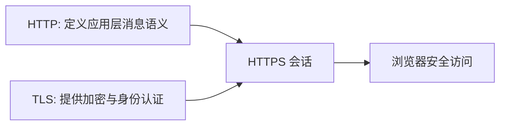

# HTTPS：把 HTTP 与 TLS 串成一条安全链路

HTTPS 不是新协议语法，而是 HTTP 运行在 TLS 安全通道之上。可以理解为：

- HTTP 负责语义（请求、响应、状态码、Header）。
- TLS 负责安全（加密、完整性、身份认证）。

两者组合后才形成我们日常访问网站时看到的 HTTPS。

---

## 1. 三者关系一图流

一句话：HTTPS = HTTP + TLS。

---

## 2. 请求实际经历了什么

1. 客户端发起 TLS 握手并验证服务端证书。
2. 握手完成后建立加密通道。
3. HTTP 请求与响应在 TLS 通道内传输。
4. 中间节点即使截获流量，也无法读懂正文。

---

## 3. 为什么还会看到“证书不安全”

出现该提示通常不是 HTTPS 无效，而是某个安全前提被破坏：

- 证书过期。
- 域名与证书不匹配。
- 证书链不完整。
- 本地时间错误导致校验失败。

---

## 4. 相关文章

- [HTTP：应用层请求与响应模型](./http.md)
- [SSL/TLS：传输层安全机制](./tls.md)
- [SSH：远程登录与安全隧道基础](./ssh.md)
