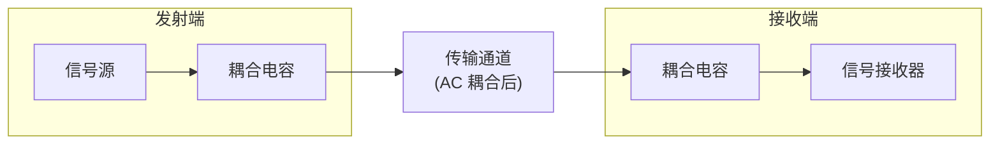
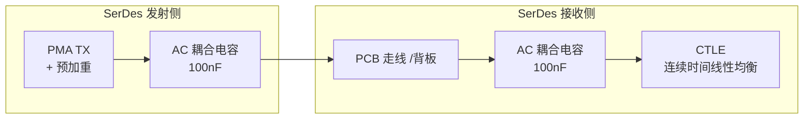

# AC 耦合技术文档

## 1. 什么是 AC 耦合

在电子信号传输中，一个电压信号可以分解为**直流分量（DC）**和**交流分量（AC）**两部分。直流分量是信号的静态偏置电平，交流分量是其中随时间变化的部分。

AC 耦合的核心功能是：**允许交流分量通过，同时阻断直流分量**，即允许第一级电路的交流信号通过并传输到下一级，同时阻断直流信号。

这一特性在高速串行链路中尤为关键——发射端与接收端可能因为制造工艺不同或存在地电位差而工作在不同共模电压下，若不进行隔离，直流偏置差异会直接导致接收端偏置点偏离最佳眼图中心引发信号失真，并且AC耦合电容也为接收端通过内部网络"重构"自身最佳偏置创造了条件。

**那为何需要 AC 耦合呢？**

在跨板、跨系统或长距离传输场景中，发射端与接收端通常由不同电源域供电，存在固有的共模电压差异。此外，地电位漂移（ground potential difference）也会在两端引入额外的直流偏移。直接 DC 耦合会导致：

- 接收端共模输入超出允许范围，信号无法正常接收
- 偏置点不在最佳眼图中心，BER 恶化

AC 耦合通过串联电容将两端在直流域隔离，使各自可以工作在独立偏置条件下，从而解决上述问题。

上图所示，耦合电容位于发射端与传输线之间，以及传输线与接收端之间，承担了直流隔离的任务。

::: warning ❓ 那我问你：为什么高速串行链路必须用 AC 耦合，不能直接 DC 耦合？
面试官推了推眼镜："高速 SerDes 动不动就几 Gbps，你告诉我为什么不能像低速信号一样直接连线传输？AC 耦合到底解决了什么问题？"

::: details 💡 点击查看满分回答
**高速链路绝对不能直接 DC 耦合！会导致信号完全失真。**

1. **共模电压差异**：发射端和接收端通常在不同 PCB 上，由不同电源供电。地电位差可能达到几伏，直接 DC 耦合会导致接收端偏置点偏离最佳眼图中心，BER 恶化 1000 倍以上。

2. **制造工艺差异**：不同芯片的共模输出电压可能相差 0.5-1V，直接耦合会让接收端工作在非线性区，信号失真严重。

3. **热漂移与电源噪声**：温度变化和电源纹波会导致共模电压缓慢变化，DC 耦合会让这些噪声直接叠加到信号上。

**总结**：AC 耦合通过电容隔离直流域，让发射端和接收端各自独立工作在最佳偏置条件下，是高速链路的"安全带"，没有它高速通信就是天方夜谭。
:::

---

## 2. 基本原理

### 2.1 理想电容的频率阻抗特性

电容器对交流信号呈现的阻抗 $Z_C$ 由容值和信号频率决定：

$$
Z_C = \frac{1}{j\omega C} = \frac{1}{j2\pi f C}
$$

从公式可以看出：

| 频率 | 阻抗 | 效果 |
|------|------|------|
| $f \to 0$（直流） | $\|Z_C\| \to \infty$ | 近似开路，阻断直流 |
| $f$ 升高 | $\|Z_C\|$ 减小 | 交流信号逐渐可以通过 |
| $f \to \infty$ | $\|Z_C\| \to 0$ | 近似短路 |

因此，理想电容器在电路中表现为一个**频率依赖的"可变阻抗"**——对低频信号呈现高阻抗（阻断），对高频信号呈现低阻抗（通过）。

### 2.2 实际电容的阻抗特性

在 MHz 至 GHz 的高频段，物理电容并不能被视为简单的理想阻抗 $1/j\omega C$。实际电容器是一个**包含了等效串联电阻（ESR）和等效串联电感（ESL）的 RLC 复数阻抗体**：

- **等效串联电阻（ESR）**：导致信号在通过电容时发生衰减，并将部分能量转化为热能。
- **等效串联电感（ESL）**：与电容自身共同决定一个**自谐振频率（SRF）**。在信号频率到达谐振频率之前，电容整体呈容性；**一旦频率超过自谐振频率，寄生电感（ESL）将起主导作用，电容器表现为电感性**，阻抗随频率升高而增大。

因此，在 GHz+ 频段选用电容时，SRF 是比容值更关键的参数。

### 2.3 一阶高通滤波器视角

串联的耦合电容与下一级电路的输入阻抗共同构成一个**一阶高通滤波器**。其截止频率为：

$$
f_{3dB} = \frac{1}{2\pi R C}
$$

其中 $R$ 为接收端的差分输入阻抗（高速 SerDes 接收端通常为 $100\Omega$ 差分或芯片手册中的 DC 输入阻抗值）。

**设计时需确保**：最低有用信号频率对应的阻抗应远小于 $R$：
$$
f_{min} \gg \frac{1}{2\pi R C}
$$

---

## 3. AC 耦合的前提

AC 耦合并非在所有场景下都适用，其有效性建立在以下前提之上。

### 3.1 DC 隔离的必要性

当发射端与接收端共模电压存在差异时，DC 耦合会导致接收端偏置点偏离最佳眼图中心，甚至超出接收端的共模输入范围：

| 耦合方式 | 共模电压差异容忍度 | 典型应用 |
|----------|-------------------|----------|
| DC 耦合 | 要求两端共模严格一致 | 芯片内部时钟、同一板内相同电源域 |
| AC 耦合 | 由耦合电容隔离，共模独立 | SerDes 跨板、跨系统、背板 |

### 3.2 信号须满足的条件

使用 AC 耦合前，需确认以下条件成立：

1. **信号边沿足够陡**：高速信号的边沿包含丰富的高频分量，能够通过耦合电容。低速信号（边沿时间 >> 耦合时间常数）经过 AC 耦合后会显著失真。
2. **DC编码平衡**：AC 耦合会滤除信号中的低频/直流部分。长连 0 或长连 1 序列的直流电平在耦合后会发生漂移，需确认接收端 CDR 能容忍。如采用 **8b/10b** 或 **128b/130b** 编码的协议（如 PCIe、SATA、USB3.0 等），信号在统计意义上直流成分为零，可通过 AC 耦合电容传输。
3. **接收端能建立自偏置**：接收端内部需要具有电阻分压或偏置网络，能自动建立输入端的共模参考电平（如 0.9 V 或 1.2 V）。  如高速 SerDes 接收端通常内置自偏置电路，无需外部提供直流共模。若使用自定义接收电路，需确认其具备此能力。

### 3.3 不适合 AC 耦合的场景

| 场景 | 原因 |
|------|------|
| 低频模拟信号（< 1MHz） | 耦合电容的阻抗过大，严重衰减低频内容 |
| 直流宽带探头 | AC 耦合会阻断待测的直流分量 |
| I²C、SPI 等低速总线 | 边沿缓慢，AC 耦合导致边沿严重畸变 |
| 某些低速协议（如 RS-232） | 协议本身规定了直流共模，不适合 AC 耦合 |

---

## 4. 设计参数如何选取

### 4.1 理论计算

#### 耦合电容的阻抗计算

对于一个 10Gbps 的 NRZ 信号，其第一零点频率约为 10GHz（即数据速率本身）。若选取 100nF 电容：

$$
Z_C = \frac{1}{2\pi \times 10 \times 10^9 \times 100 \times 10^{-9}} \approx 0.16\ \Omega
$$

$0.16\Omega$ 的阻抗相对于传输线 $50\Omega$ 特性阻抗可以忽略不计，不会对信号造成显著衰减。

#### 低频截止频率

耦合电容与接收端输入阻抗构成的高通滤波器截止频率为：

$$
f_{3dB} = \frac{1}{2\pi R C}
$$

**设计时需确保**：最低有用信号频率对应的阻抗应远小于 $R$：
$$
f_{min} \gg \frac{1}{2\pi R C}
$$

#### RC 时间常数：信号 Droop 与基线漂移

在时域中，信号的传输完整性取决于 RC 时间常数。当传输较宽的脉冲或连续的相同逻辑电平（如连续的"1"或"0"）时，电容会发生充放电现象。若时间常数不足以维持该脉冲宽度，信号顶部会出现明显的电压跌落（Tilt 或 Droop）。

由于 AC 耦合滤除了信号的低频能量，如果输入的数据流在统计上缺乏直流平衡，信号的直流平均电平会随时间发生缓慢漂移，导致接收端眼图闭合、眼高减小，这一现象被称为**基线漫游（Baseline Wander）**。

设计时需确保时间常数足够大，使 Droop 和 Baseline Wander 控制在接收端可容忍范围内。

### 4.2 工程实践

#### 容值选取原则

| 需求场景 | 推荐容值 | 说明 |
|----------|----------|------|
| 10G+ SerDes | 100nF | 低阻抗，宽带宽 |
| PCIe Gen3/4 | 100nF | 规范要求 |
| 1G 以太网 | 10nF–100nF | 视链路长度而定 |
| 音频耦合 | 1µF–10µF | 低频信号需要更大容值 |

**过大容值的问题**：占用 PCB 面积大，成本增加，大封装电容的寄生电感（ESL）更大。

**过小容值的问题**：低频阻抗增大，导致低频信号衰减，码间干扰（ISI）加重。

#### 可靠性考虑

- **耐压**：选取耐压为工作电压 2–3 倍的电容（常用 16V、25V）
- **温度特性**：NP0/C0G（陶瓷）电容温度稳定性最好，适用于高速链路
- **封装**：0402/0201 是高速电路主流，寄生电感更小

---

## 5. 在高速链路中的应用

### 5.1 SerDes 链路

在高速串行收发器（Serializer/Deserializer）中，AC 耦合几乎是标配。以 10G SerDes 为例：

常见耦合电容位置：发射端与 PCB 走线之间、连接器两侧、接收端输入前端。

### 5.2 PCIe、SATA、USB、以太网

#### USB 3.0/3.2 规范中的 AC 耦合要求

在《Universal Serial Bus 3.2 Specification》中，AC 耦合电容的具体要求如下：

**发射端（TX）AC 耦合电容：**
- 参考范围：75nF - 265nF
- 规范位置：Table 6-18. Transmitter Normative Electrical Parameters

**接收端（RX）AC 耦合电容：**
- 可选配置
- 如果使用，电容值范围：297nF - 363nF
- 规范位置：Table 6-22. Receiver Normative Electrical Parameters

#### 版本差异说明

值得一提的是，在 USB-IF 发布《3.2 Specification》之前的《3.0 Specification》标准中：
- TX 的 AC 耦合电容最大值是不同的
- RX 的 AC 耦合电容也是没有的

以 PCIe 为例，规范（PCIe Base Spec）要求耦合电容位于发送端和接收端之间，每条差分 lane 必须串联一个电容，用于阻断发射端与接收端的共模直流偏置差异。

具体的耦合电容应该放在那里，可转至 [耦合电容到底怎么放](/under-construction) 查阅

---

## 6. 常见误区与设计陷阱

### 6.1 欠耦合：电容容值过小

| 症状 | 原因 |
|------|------|
| 低频内容丢失 | $f_{3dB}$ 过高，低于信号最低频率分量 |
| 眼图塌陷 | 长连 0/1 序列的低频部分被衰减 |

### 6.2 过耦合：电容容值盲目求大

| 症状 | 原因 |
|------|------|
| 占用 PCB 面积大 | 高容值需要更大封装 |
| 上电冲击电流增大 | 电容越大，瞬态充电电流越大 |

### 6.3 混淆 AC 耦合与 DC 偏置

AC 耦合**阻断直流**，但**不提供直流偏置**。如果接收端需要特定共模电压，必须在接收端单独设计 DC 偏置电路（如电阻分压到 VDD/2）。

### 6.4 耦合电容位置不当

| 错误 | 后果 |
|------|------|
| 将耦合电容放在驱动端输出与端接电阻之间 | 端接电阻与电容形成低通滤波器，恶化高频 |
| 在发送端预加重/去加重后立即放置耦合电容 | 预加重的高频分量被进一步放大，可能超出传输线线性范围 |

### 6.5 忽视电容的阻抗相位特性

实际电容在高频下表现为 **ESR + ESL + C** 的串联模型，而非理想电容。当频率超过电容自谐振频率（SRF）后，电容不再表现为容性，而表现为感性：

$$
Z_{real} \approx ESR + j(\omega L - \frac{1}{\omega C})
$$

### 6.6 前提条件未确认

许多设计陷阱的根本原因在于使用 AC 耦合前未充分评估第 3 章的前提条件：

| 忽略的前提 | 后果 |
|-----------|------|
| 信号边沿不够陡 | 耦合后信号严重失真，边沿无法被接收端可靠识别 |
| 接收端无自偏置能力 | 接收端偏置悬空，信号无法被正确判决 |
| 在低压差分信号（LVPECL、CML）混用场景 | 耦合后共模电压不匹配，引发额外直流偏移 |

---

## 小结

AC 耦合是高速数字链路中一项基础却至关重要的设计技术。其本质是利用电容的频率阻抗特性——阻断直流分量通过，同时对高速交流信号呈现极低的阻抗。在实际设计中，需要综合考虑信号最低频率、阻抗匹配、封装尺寸和可靠性，选择合适的容值和放置位置。

理解这一技术背后的物理原理，而非机械地套用经验值，是避免设计陷阱的根本。
